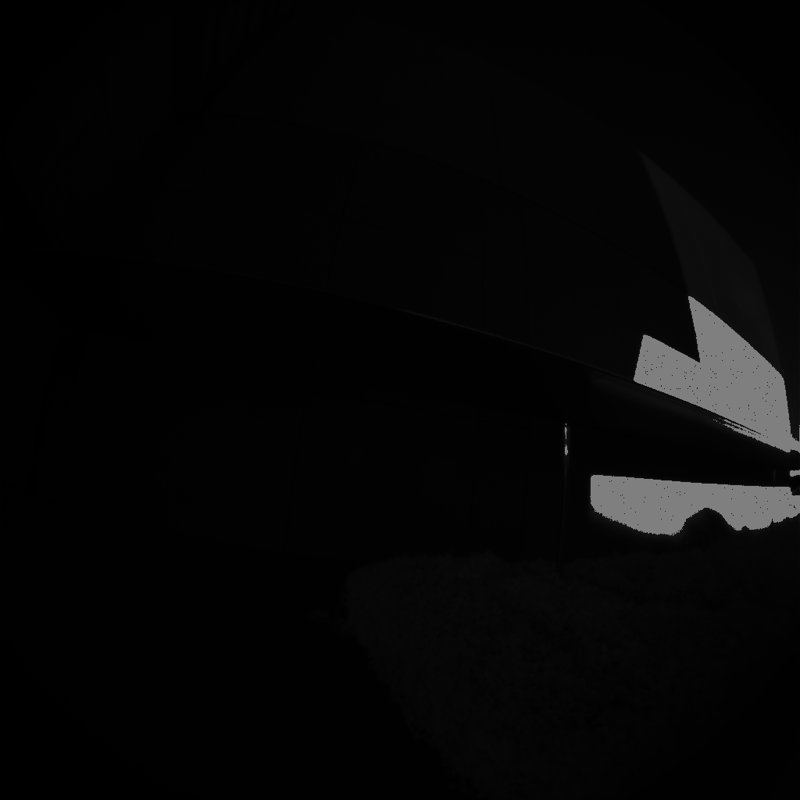
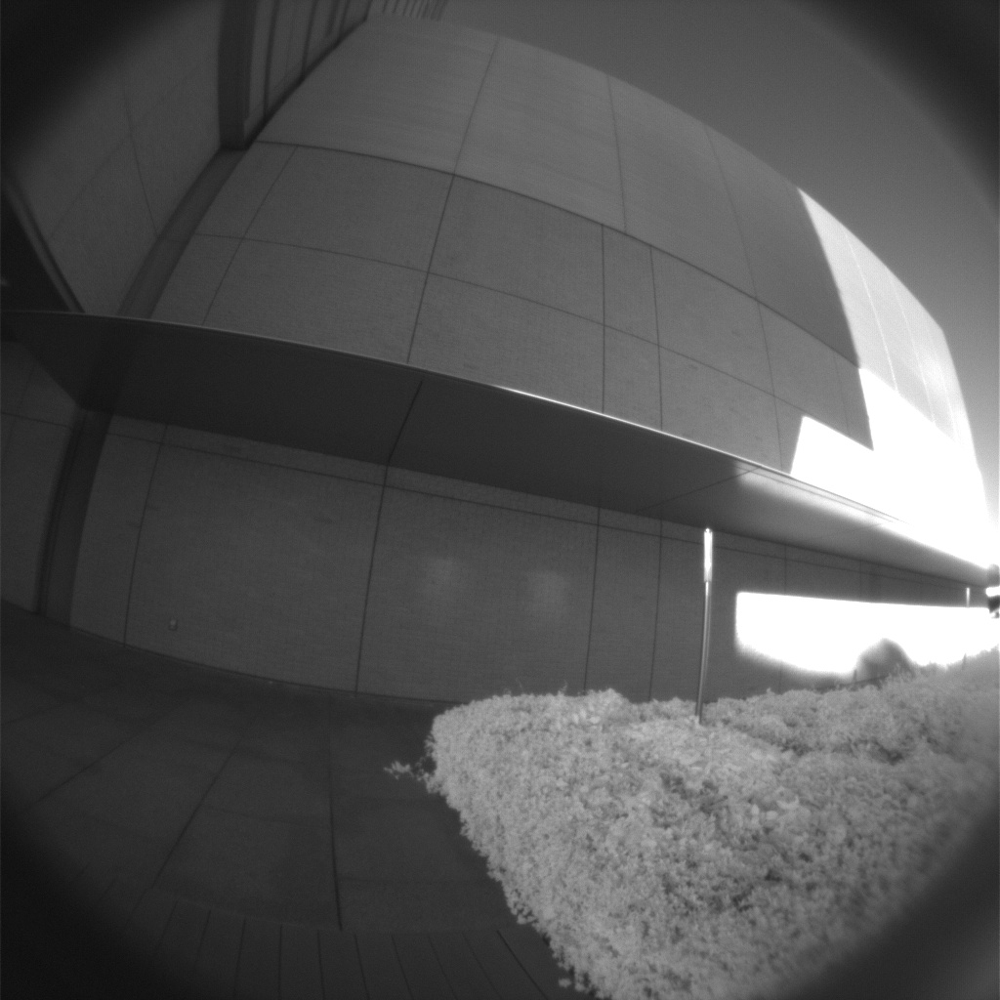

# Azure Kinect IR Image Streamer

The goal of this project is to process the raw InfraRed 16 bits of the Azure Kinect into usable images.




## Requirements
- OpenCV
- CMake

## Build
```bash
mkdir build
cd build
cmake ..
make
```

## Run
```
./AKIRS <path of the image> <gamma> <path to save>
```
`<gamma>` and `<path to save>` are optionnal. 
### Example
```
./AKIRS ../img/parking/data-0003-depth.png 0.6 ../output/parking-0003.jpg
```

## Observation
- Output image never exceeds `0x7fff`.
    - Stangely, noise is observed in both LSB and MSB
- Trees looks weird as they reflect IR very well.

## Principle
Data are encoded on 16 bits. Classical methods treat it with two strategies:
- Right bit shift of 8 bits which leads to loss of information
- Left bit shift of 8 bits and display the image on a depth 8 support (which implies a division)

I estimated empirically the noise to be within 3 LSB in the MSB. The image gets a gamma-correction to gain details in the low light while being in floating point.

$$I_{out} = \left(\frac{I_{in}}{I_{in_{max}} / 8}\right)^\gamma$$

Where $\gamma$ seems to be between $0.6$ and $0.8$ for the best performance. (The lower, the more low light information we regain).

## Future works
- Find another correction function?
- Accelerate the processing for real time (OpenMP or OpenCL)
- "Learning based" estimation of $\gamma$. (Using a sample of images and determine the best $\gamma$ by searching for the most good quality ORB features with the sample.)
- Create a ROS 1/2 node from this